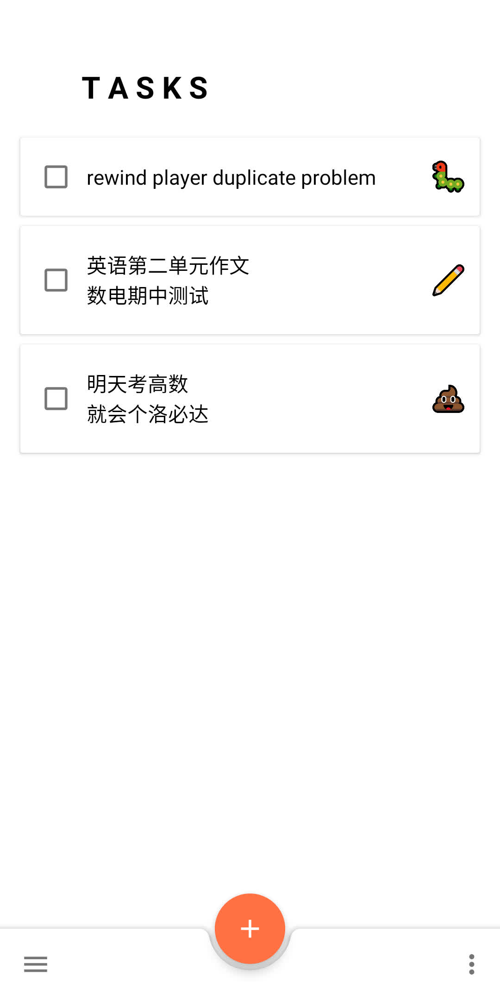
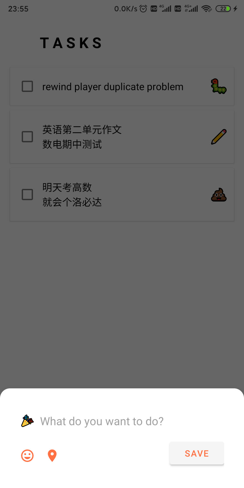
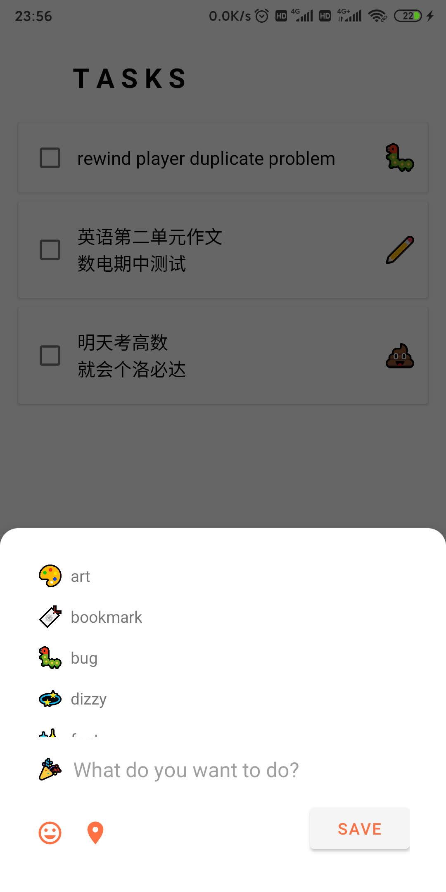

# Tangerine

Under Construction

A todo list app written in kotlin.

## Intro

- It is very simple.
- Similar to Google Tasks.
- Inspired by gitmoji, like the commits with emojis, every task you add will be with an emoji.

## Screenshots

</img>

</img>

</img>

## Open Source

- Android
- Kotlin
- Google Material Design
- Room, Dao as local database

## LICENSE

- MIT
